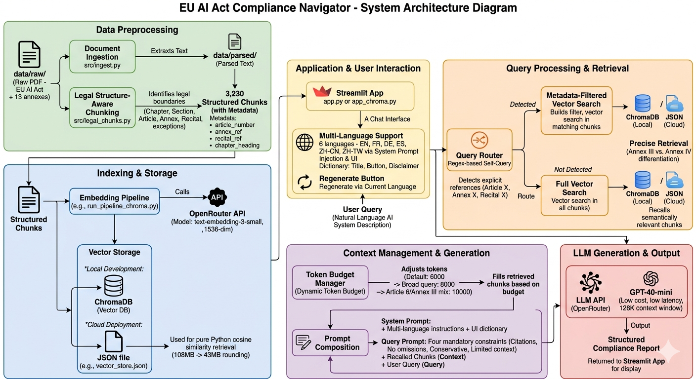
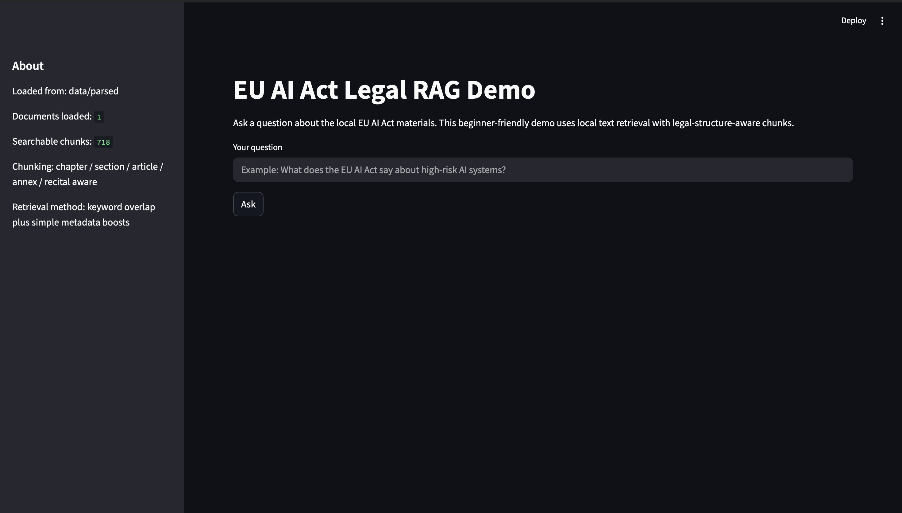
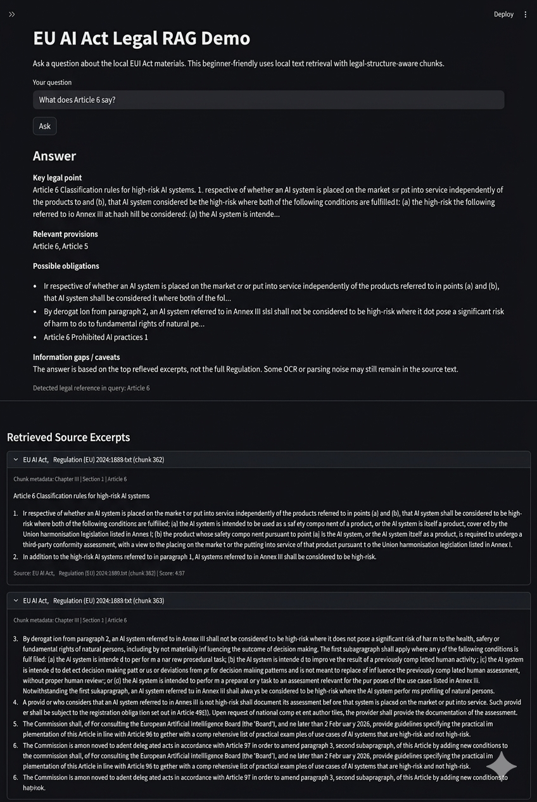
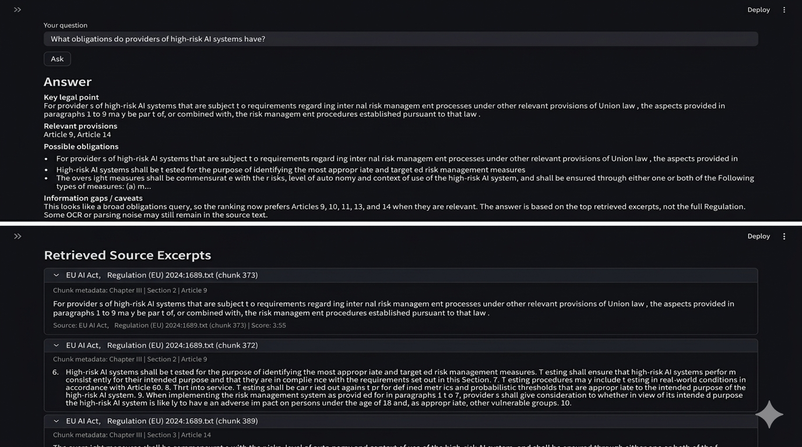

# ⚖️ EU AI Act Compliance Navigator

A RAG-based compliance assessment tool for the EU Artificial Intelligence Act (Regulation 2024/1689). Users describe their AI system in natural language, and the tool retrieves relevant legal provisions and generates a structured compliance report.

**Live Demo:** [eu-ai-act-legal-rag-prototype.streamlit.app](https://eu-ai-act-legal-rag-prototype-hgryem2gsyrmyz7m6tda6c.streamlit.app)

## What It Does

1. **Risk Classification** — Input an AI system description → receive risk tier (Unacceptable / High-Risk / Limited / Minimal) with article citations
1. **Obligation Mapping** — Outputs specific compliance requirements with article references
1. **Cross-Regulatory Analysis** — Identifies overlapping obligations from GDPR, product safety, and cybersecurity frameworks
1. **Source Transparency** — Every answer cites specific articles, recitals, and annexes
1. **Smart Routing** — Automatically detects legal references (Article, Annex, Recital) in queries for precision metadata-filtered retrieval

## Technical Architecture



```
User Input
    → Self-Query Router (regex-based legal reference detection)
    → [Metadata Filter / Full Vector Search]
    → Dynamic Token Budget (auto-adjusts by query complexity)
    → GPT-4o-mini Structured Compliance Assessment
```

|Component       |Technology                                             |
|----------------|-------------------------------------------------------|
|Document Parsing|pypdf + legal-structure-aware chunking                 |
|Embeddings      |OpenAI text-embedding-3-small (1536 dim) via OpenRouter|
|Vector Store    |ChromaDB (local pipeline) + JSON export (deployed app) |
|Retrieval       |Self-Query routing + dynamic token budget              |
|LLM             |GPT-4o-mini via OpenRouter                             |
|Frontend        |Streamlit (chat interface)                             |

**Why legal-structure-aware chunking?** Standard RAG systems split text by 
fixed token length. EU AI Act provisions have hierarchical dependencies — 
Article 6's classification rules reference Annex III's high-risk list, 
which in turn triggers obligations spread across Articles 9–14. Fixed-length 
splitting severs these connections. The chunker in `src/legal_chunks.py` 
respects Chapter, Section, Article, and Annex boundaries, preserving the 
legal logic each chunk carries.

**Why Self-Query routing instead of pure semantic search?** Annex III 
(high-risk AI system categories) and Annex IV (technical documentation 
requirements) are semantically similar in embedding space — same legal 
register, similar structure — but their legal consequences are mutually 
exclusive. Semantic-only retrieval conflates them. The regex router detects 
explicit legal references and applies metadata filters before vector search, 
eliminating this class of error for direct citation queries.

## Key Features

- **Chat Interface** — Conversational UI with user messages right-aligned
- **6 Languages** — English, French, German, Spanish, Simplified Chinese, Traditional Chinese
- **Self-Query Routing** — Mentions of “Article 6”, “Annex III”, etc. trigger metadata-filtered search
- **Dynamic Token Budget** — Auto-adjusts context window (6K–10K tokens) based on query complexity
- **Quick Query Buttons** — Pre-built scenarios for common compliance questions
- **Download Answers** — Export individual answers or full chat history as Markdown
- **Regenerate in New Language** — Switch language and regenerate any previous answer

## Screenshots





## External Showcase

To present the project in a public evaluation setting, this prototype was submitted to Hack Trek 2026 on Devpost.

This submission reflects the project’s transition from a private prototype to a publicly demonstrable legal-tech tool for EU AI Act compliance analysis.

- Devpost submission: https://devpost.com/software/ai-compliance-copilot-for-the-eu-ai-act
- Demo video: https://youtu.be/H4M3oPX7sz4

## Repository Structure

```
├── app_chroma.py          # Main Streamlit app (chat UI + RAG pipeline)
├── run_pipeline_chroma.py # Embedding generation + ChromaDB ingestion
├── vector_store.json      # Pre-computed embeddings (3230 chunks)
├── requirements.txt       # Python dependencies
├── src/
│   ├── ingest.py          # Document parsing (PDF/TXT → plain text)
│   └── legal_chunks.py    # Legal-structure-aware chunking + metadata
├── eval/
│   └── golden_queries.json
├── scripts/
│   └── evaluate_retrieval.py
└── data/
    ├── raw/               # Source legal documents (PDF)
    └── parsed/            # Extracted plain text
```

## How to Run Locally

```bash
git clone https://github.com/miles2005-web/eu-ai-act-legal-rag-prototype.git
cd eu-ai-act-legal-rag-prototype
python3.12 -m venv venv
source venv/bin/activate
pip install streamlit openai chromadb pypdf
export OPENROUTER_API_KEY="your-key-here"
streamlit run app_chroma.py
```

## Adding New Legal Documents

1. Place PDF files in `data/raw/`
1. Run `python src/ingest.py` to parse
1. Run `python run_pipeline_chroma.py` to generate embeddings
1. Export updated vector store:

```bash
python -c "
import json, chromadb
db = chromadb.PersistentClient(path='./chroma_db')
col = db.get_collection('eu_ai_act')
data = col.get(include=['documents','metadatas','embeddings'])
export = []
for i in range(len(data['ids'])):
    emb = data['embeddings'][i]
    if hasattr(emb, 'tolist'): emb = emb.tolist()
    export.append({'id':data['ids'][i],'document':data['documents'][i],'metadata':data['metadatas'][i],'embedding':[round(x,5) for x in emb]})
with open('vector_store.json','w') as f:
    json.dump(export, f, separators=(',',':'))
print(f'Exported {len(export)} records')
"
```

1. Push updated `vector_store.json` to GitHub

## Example Questions

- “What does Article 6 say about high-risk AI classification?”
- “An AI system that screens job applicants’ CVs and ranks candidates.”
- “What obligations do providers of high-risk AI systems have?”
- “What AI systems are listed in Annex III?”
- “What transparency requirements apply to AI systems?”
- “What AI practices are prohibited under the EU AI Act?”
- “Does my biometric identification system fall under Annex III?”
- “What does Article 9 require for risk management?”

## Legal Documents Coverage

**Primary Legislation (EU AI Act)**

| Document | Notes |
|---|---|
| EU AI Act — Full Text (Regulation 2024/1689) | Articles 1–113 |
| EU AI Act — Recitals 1–180 | Indexed separately for precision retrieval |
| EU AI Act — Annexes I–XIII | Indexed separately; Annex III (high-risk list) and Annex IV (technical documentation) treated as distinct retrieval targets |

**Cross-Regulatory Framework**

| Document | Relevance |
|---|---|
| GDPR (Regulation 2016/679) | Data governance obligations intersecting high-risk AI systems |
| Cyber Resilience Act (Regulation 2024/2847) | Cybersecurity requirements cross-referenced in AI Act |
| Product Liability Directive (2024/2853) | Liability framework for AI-embedded products |
| AI Liability Directive — Proposal (COM/2022/496) | Proposed civil liability regime for AI systems |
| Machinery Regulation (2023/1230) | Safety requirements for AI integrated into machinery |

**Official Guidance**

| Document | Source |
|---|---|
| EU AI Act FAQ / Implementation Guidelines | European Commission |
| Codes of Practice for General-Purpose AI | EU AI Office |
| AI Act Compliance Checker Flowchart v1.0 (Updated July 2025) | Future of Life Institute — decision tree mapping entity types, risk classification, and obligation triggers across Articles 5, 6, 25, 50, 51 |

**Academic Sources**

| Document | Source |
|---|---|
| "Truly Risk-Based Regulation of Artificial Intelligence: How to Implement the EU's AI Act" (Working Paper No. 101) | Martin Ebers — Stanford–Vienna Transatlantic Technology Law Forum |
| "Interplay between the AI Act and the EU Digital Legislative Framework" | European Parliament, ITRE Committee Study |
| "Systemic Data Bias in Real-World AI Systems: Technical Failures, Legal Gaps, and the Limits of the EU AI Act" | Falelakis, Dimara & Anagnostopoulos — MDPI *Information* |

**Total: 14 documents → 3,230 indexed passages**

## Background

The EU AI Act (Regulation 2024/1689) enters full enforcement on 2 August 2026. 
With 113 articles, 180 recitals, and 13 annexes, it presents a concrete 
navigability problem: organisations need to determine whether their AI system 
is high-risk, what obligations apply, and where exactly those obligations 
are located across a complex legislative structure.

This tool is an attempt to make that structure computationally navigable — 
a question at the intersection of regulatory law and retrieval system design.

Built by a law student at Jilin University (Changchun, China).


## Disclaimer

This tool provides preliminary guidance only and does not constitute legal advice. Always consult qualified legal counsel for compliance decisions.


